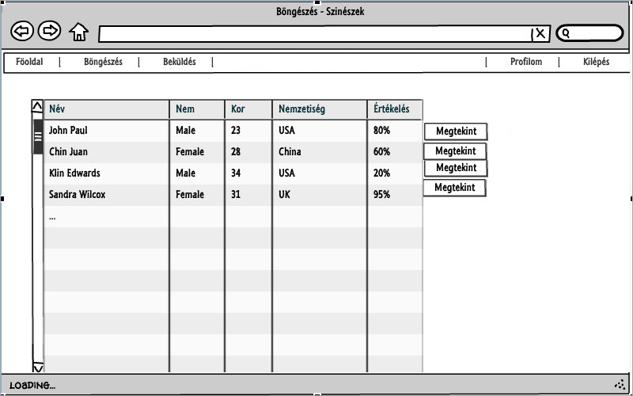

#Alkalmazások fejlesztése beadnadó
------
####Szőke Roland
####RB3KOR

#MovieZ

##Rövid leírás
Az projekt célja egy olyan webes alkalmazás készítése, mely felhasználóbarátan segíti a film fanatikusokat filmek, szinészek, rendezők nyilvántartásában.

##Követelményanalízis
------

###Funkcionális követelmények
* Vendégként a főoldalon lehetőségem nyíljon a regisztrációra.
* Vendégként a főoldalon a legnépszerűbb filmek stílus szerinti kategóriákra bontva fogadjon.
* Vendégként szeretnék a filmek, szinészek, rendezők között szabadon böngészni.
* Vendégként szeretnék részletes leírásokat megtekinteni mind filmekről, szinészekről és rendezőkről.
* Vendégként szeretnék filmeket, szinészeket, rendezőket keresni.
* Vendégként szeretnék tudni regisztrálni az oldalra.

* Felhasználóként szeretnék tudni bejelentkezni az oldalra.
* Felhasználóként szeretnék új filmeket, szinészeket vagy rendezőket beküldeni, amennyiben még nem létezik létrehozott oldal nekik.
* Felhasználóként szeretnék meglévő filmeket szerkeszteni.
* Felhasználóként szeretnék meglévő filmeket törölni.
* Felhasználóként szeretnék minden olyan funkcióhoz hozzáférni, amihez a vendégek tudnak.

###Nem funkcionális követelmények
* Felhasználóbarát, ergonomikus elrendezés és kinézet.
* Gyors működés.
* Biztonságos működés: jelszavak tárolása, funkciókhoz való hozzáférés.

###Szakterületi fogalomjegyzék
* Szinész: személy, aki szerepet játszik művészeti produkcióban
* Rendező: személy, egy film művészeti és dramatikus részeinek elkészítését vezeti
* Film: információs, ismeretterjesztő, szórakoztatási és művészeti célú médium

###Szerepkörök
* vendég: filmek, rendezők, szinészek bengőszése és megtekintése
* felhasználó: a vendég szerepkörén túl képes új filmeket, rendezőket, szinészeket beküldeni, filmeket szerkeszteni vagy törölni

###Használati esetek

###Példa folyamatok meghatározása
- felhasználó
    + 
    + 

##Tervezés
------
###Oldaltérkép
Publikus:

- Főoldal
- Böngészés
    + Filmek
        * Megtekintés
    + Szinészek
        * Megtekintés
    + Rendezők
        * Megtekintés
- Belépés
- Regisztráció

Felhasználói:

- Főoldal
- Böngészés
    + Filmek
        * Megtekintés
            - Szerkesztés
            - Törlés
    + Szinészek
        * Megtekintés
    + Rendezők
        * Megtekintés
- Beküldés
    + Film
    + Szinész
    + Rendező
- Kilépés

###Végpontok
* GET /: főoldal
* GET /login: bejelentkező oldal
* POST /login: bejelentkezési adatok felküldése
* GET /logout: kijelentkezés
* GET /register: regisztráló oldal
* POST /register: regisztráló adatok felküldése
* GET /movies: film lista, keresés
* GET /actors: szinész lista, keresés
* GET /directors: rendező lista, keresés
* GET /movies/:id: film megtekintése
* GET /actors/:id: szinész megtekintése
* GET /directors/:id: rendező megtekintése
* GET /movies/create: új film felvitele, űrlap megjelenítése
* POST /movies/create: új film felvitele, adatok küldése
* GET /movies/:id/edit: film szerkesztése, űrlap megjelenítése
* POST /movies/:id/edit: film szerkesztése, adatok küldése
* GET /movies/:id/delete: film törlése
* GET /actors/create: új szinész felvitele, űrlap megjelenítése
* POST /actors/create: új szinész felvitele, adatok küldése
* GET /directors/create: új rendező felvitele, űrlap megjelenítése
* POST /directors/create: új rendező felvitele, adatok küldése

###Oldalvázlat

###Adatmodell

##Progresszív fejlesztése kliensoldali JavaScript segítségével
------
###Alapkoncepció
Kliensoldali JavaScript kódok írása, melyek nélkül az alkalmazás továbbra is működőképes, de meglétükkel az alkalmazás használata kényelmesebb, gyorsabb, felhasználóbarátabb

###Funkciók
* Ajax funkciók
    + Bejelntkezés (login)
    + Kijelntkezés (logout)
    + Regisztrálás (register)
    + Film törlése (delete)
* Főoldali dinamikus js óra
* Főoldali ablakok becsukása/kinyitása

###Érintett fájlok
* public/scripts/clock.js
* public/scripts/delete.js
* public/scripts/logout.js
* public/scripts/main.js
* public/scripts/popup_register.js
* public/scripts/popup_login.js

###Rövid leírás
Bejelentkezés/regisztrálás ajaxos megvalósítása egy popup ablakkal lett megoldva. Az adott js fájlok bekapcsolás melett az adott linkre kattintva átirányítás hejett egy popup ablak várja a from kitöltését, submit után újrageneráljuk a felső navigációs csíkot.

##Tesztek
------
###IDE
* Selinium IDE használata a létrehozott tesztekre mozzilával lehetséges
* bővítmény telepítése: https://addons.mozilla.org/hu/firefox/addon/selenium-ide/
* futtatás után Ctrl+O kombinációval megnyithatók a létrehozott tesztek, amiket a tests mappában találunk meg

###Autómatikus tesztek
* Bejelentkezésre írt teszt (login_test.html)
* Kijelentkezésre írt teszt (logout_test.html)
* Film beküldésére írt teszt (nem_movie_test.html)
* Film törlésére írt teszt (delete_movie_test.html)

