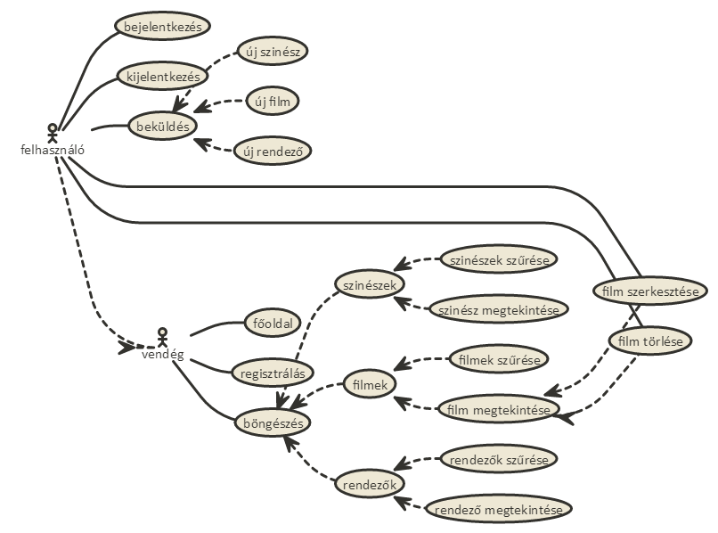

"# af_bead" 

#FilmZ

##Rövid leírás
Az projekt célja egy olyan webes alkalmazás készítése, mely felhasználóbarátan segíti a film fanatikusokat a tapasztalataik rendszerezésében filmkeről, színészekről vagy rendezőkről.
Középpontban szerepel a regisztrált felhasználók profilja, amit folyamatosan módosítanak az újjonnan szerzett filmes tapasztalataikkal.

##Követelményanalízis
------

###Funkcionális követelmények
*Vendégként a főoldalon a regisztráció fogadjon, rövid oldal ismertetővel.
*Vendégként szeretnék a filmek, szinészek, rendezők között szabadon böngészni.
*Vendégként szeretnék részletes leírásokat megtekinteni.
*Vendégként szeretnék filmeket, szinészeket, rendezőket keresni.
*Vendégként szeretnék tudni regisztrálni az oldalra.

*Felhasználóként szeretnék tudni bejelentkezni az oldalra.
*Felhasználóként szeretném tudni a profiladataimat szerkeszteni.
*Felhasználóként szeretnék új filmeket, szinészeket vagy rendezőket beküldeni, amennyiben még nem létezik létrehozott oldal nekik.
*Felhasználóként szeretném a filmeket a "Megnézendő" listámhoz adni.
*Felhasználóként szeretném a megtekintett filmeimet, ismert szinészeket, rendezőket külön listában rendszerezni, értékelni, rövid kritikát/észrevétel fűzni hozzájuk, kedvencekhez csatolni.

###Nem funkcionális követelmények
*Felhasználóbarát, ergonomikus elrendezés és kinézet.
*Gyors működés.
*Biztonságos működés: jelszavak tárolása, funkciókhoz való hozzáférés.

###Szakterületi fogalomjegyzék
*Szinész: személy, aki szerepet játszik művészeti produkcióban
*Rendező: személy, egy film művészeti és dramatikus részeinek elkészítését vezeti
*Film: információs, ismeretterjesztő, szórakoztatási és művészeti célú médium

###Szerepkörök
*vendég:filmek, rendezők, szinészek bengőszése és megtekintése
*felhasználó: a vendég szerepkörén túl képes új filmeket, rendezőket, szinészeket beküldeni, saját listába rendezni a már meglévőket, megjegyzéseket fűzni hozzájuk

###Használati esetek

###Folyamatok meghatározása
-felhasználó
    +
    +
-vendég
    +keresés...
    +regisztrálás...

##Tervezés
------
###Oldaltérkép
Publikus:

- Főoldal
- Böngészés
    + Filmek
        * Megtekintés
    + Szinészek
        * Megtekintés
    + Rendezők
        * Megtekintés
- Belépés
- Regisztráció
- Keresés

Felhasználói:

- Kilépés
- Profiladatok
    + Profiladatok szerkesztése
- Beküldés
    + Film
    + Szinész
    + Rendező
- Kedvencek
    + Filmek
    + Szinészek
    + Rendezők
- Megnézendő filmek
- Megtekintett filmek

###Végpontok
*GET /: főoldal
*GET /login: bejelentkező oldal
*POST /login: bejelentkezési adatok felküldése
*GET /profile: profiladatok
*GET /profile/change: profiladatok módosítása, űrlap megjelenítése
*POST /profile/change: profiladatok módosítása, adatok küldése
*GET /movies: film lista
*GET /actors: szinész lista
*GET /directors: rendező lista
*GET /movies/:id: film megtekintése
*GET /actors/:id: szinész megtekintése
*GET /directors/:id: rendező megtekintése
*GET /movies/create: új film felvitele, űrlap megjelenítése
*POST /movies/create: új film felvitele, adatok küldése
*GET /actors/create: új szinész felvitele, űrlap megjelenítése
*POST /actors/create: új szinész felvitele, adatok küldése
*GET /directors/create: új rendező felvitele, űrlap megjelenítése
*POST /directors/create: új rendező felvitele, adatok küldése
*GET /favorites/movies: kedvenc filmek
*GET /favorites/actor: kedvenc szinészek
*GET /favorites/directors: kedvenc rendezők
*GET /seen/movies: látott filmek
*GET /tosee/actor: megnézendő filmek

###Oldalvázlat
*
*
*

###Adatmodell
*
